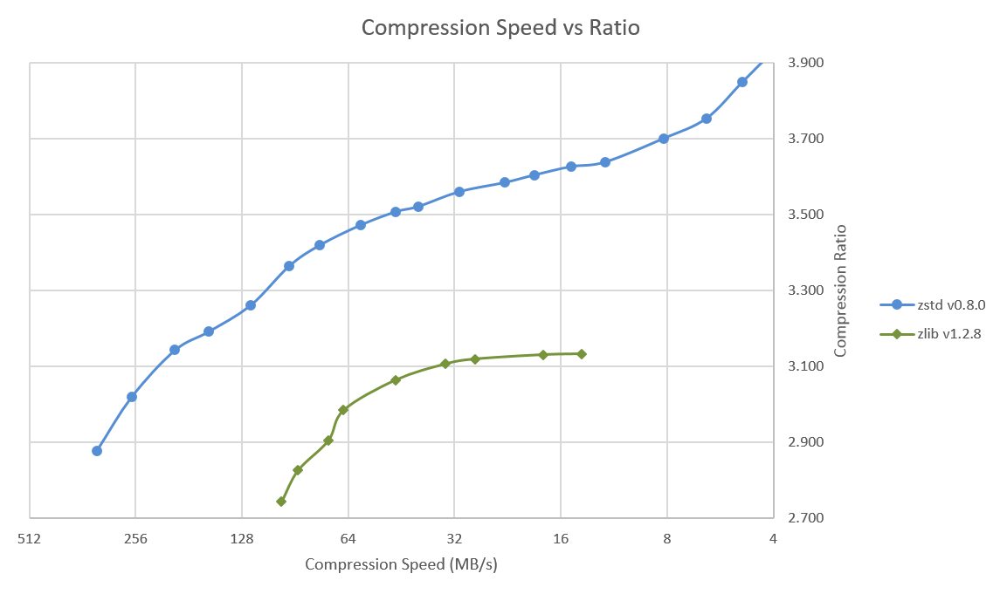
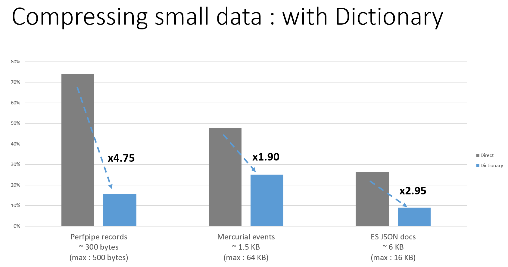

 **Zstd**, short for Zstandard, is a fast lossless compression algorithm,
 targeting real-time compression scenarios at zlib-level and better compression ratios.

It is provided as an open-source BSD-licensed **C** library.
For other programming languages,
you can consult a list of known ports on [Zstandard homepage](http://www.zstd.net/#other-languages).

|Branch      |Status   |
|------------|---------|
|master      |  |
|dev         |  |

As a reference, several fast compression algorithms were tested and compared on a Core i7-3930K CPU @ 4.5GHz, using [lzbench], an open-source in-memory benchmark by @inikep compiled with GCC 5.4.0, with the [Silesia compression corpus].

[lzbench]: https://github.com/inikep/lzbench
[Silesia compression corpus]: http://sun.aei.polsl.pl/~sdeor/index.php?page=silesia

|Name             | Ratio | C.speed | D.speed |
|-----------------|-------|--------:|--------:|
|                 |       |   MB/s  |  MB/s   |
|**zstd 0.8.2 -1**|**2.877**|**330**| **940** |
| [zlib] 1.2.8 -1 | 2.730 |    95   |   360   |
| brotli 0.4 -0   | 2.708 |   320   |   375   |
| QuickLZ 1.5     | 2.237 |   510   |   605   |
| LZO 2.09        | 2.106 |   610   |   870   |
| [LZ4] r131      | 2.101 |   620   |  3100   |
| Snappy 1.1.3    | 2.091 |   480   |  1600   |
| LZF 3.6         | 2.077 |   375   |   790   |

[zlib]:http://www.zlib.net/
[LZ4]: http://www.lz4.org/

Zstd can also offer stronger compression ratios at the cost of compression speed.
Speed vs Compression trade-off is configurable by small increments. Decompression speed is preserved and remains roughly the same at all settings, a property shared by most LZ compression algorithms, such as [zlib] or lzma.

The following tests were run on a Core i7-3930K CPU @ 4.5GHz, using [lzbench], an open-source in-memory benchmark by @inikep compiled with GCC 5.2.1, on the [Silesia compression corpus].

Compression Speed vs Ratio | Decompression Speed
---------------------------|--------------------
 | 

Several algorithms can produce higher compression ratios, but at slower speeds, falling outside of the graph.
For a larger picture including very slow modes, [click on this link](images/DCspeed5.png) .

### The case for Small Data compression

Previous charts provide results applicable to typical file and stream scenarios (several MB). Small data comes with different perspectives. The smaller the amount of data to compress, the more difficult it is to achieve any significant compression.

This problem is common to many compression algorithms. The reason is, compression algorithms learn from past data how to compress future data. But at the beginning of a new file, there is no "past" to build upon.

To solve this situation, Zstd offers a __training mode__, which can be used to tune the algorithm for a selected type of data, by providing it with a few samples. The result of the training is stored in a file called "dictionary", which can be loaded before compression and decompression. Using this dictionary, the compression ratio achievable on small data improves dramatically:

These compression gains are achieved while simultaneously providing faster compression and decompression speeds.

Dictionary works if there is some correlation in a family of small data (there is no _universal dictionary_).
Hence, deploying one dictionary per type of data will provide the greatest benefits. Dictionary gains are mostly effective in the first few KB. Then, the compression algorithm will rely more and more on previously decoded content to compress the rest of the file.

#### Dictionary compression How To :

1) Create the dictionary

`zstd --train FullPathToTrainingSet/* -o dictionaryName`

2) Compress with dictionary

`zstd FILE -D dictionaryName`

3) Decompress with dictionary

`zstd --decompress FILE.zst -D dictionaryName`

### Build

Once you have the repository cloned, there are multiple ways provided to build Zstandard.

#### Makefile

If your system is compatible with `make`, you can simply run `make` at the root directory.
It will generate `zstd` within root directory.

Other available options include :
- `make install` : create and install zstd binary, library and man page
- `make test` : create and run `zstd` and test tools on local platform

#### cmake

A `cmake` project generator is provided within `build/cmake`.
It can generate Makefiles or other build scripts
to create `zstd` binary, and `libzstd` dynamic and static libraries.

#### Visual (Windows)

Going into `build` directory, you will find additional possibilities :
- Projects for Visual Studio 2005, 2008 and 2010
  + VS2010 project is compatible with VS2012, VS2013 and VS2015
- Automated build scripts for Visual compiler by @KrzysFR , in `build/VS_scripts`,
  which will build `zstd` cli and `libzstd` library without any need to open Visual Studio solution.

### Status

Zstandard is currently deployed within Facebook. It is used daily to compress and decompress very large amounts of data in multiple formats and use cases.
Zstandard is considered safe for production environments.

### License

Zstandard is [BSD-licensed](LICENSE). We also provide an [additional patent grant](PATENTS).

### Contributing

The "dev" branch is the one where all contributions will be merged before reaching "master".
If you plan to propose a patch, please commit into the "dev" branch or its own feature branch.
Direct commit to "master" are not permitted.
For more information, please read [CONTRIBUTING](CONTRIBUTING.md).

### Miscellaneous

Zstd entropy stage is provided by [Huff0 and FSE, from Finite State Entropy library](https://github.com/Cyan4973/FiniteStateEntropy).
